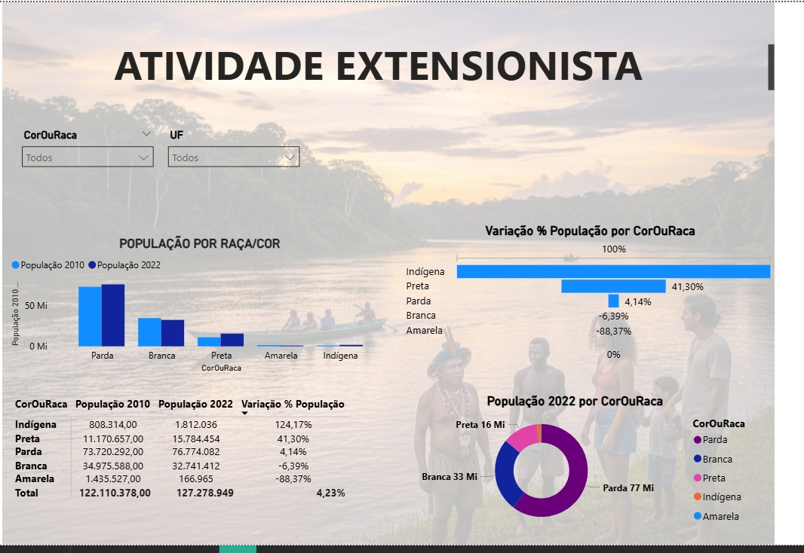
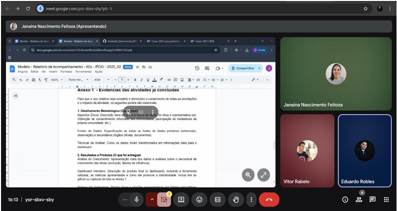

# Atividade_Extensionista_IPOG_Banco_De_Dados

# Percentual de crescimento de etnias na Região Norte do país.

# Definição do Escopo: 
Dashboard Criativo do Percentual de Crescimento de Etnias na Região Norte do País.

# Objetivo geral: 
Desenvolver um dashboard criativo com foco em narrativa (data storytelling) para simplificar dados de impacto social complexos. Este produto funciona como a solução direta para o Challenge Based Learning (CBL), ou Aprendizagem Baseada em Desafios. O painel será uma ferramenta de transparência para a comunidade, mostrando os resultados concretos da colaboração entre uma organização social/ONG e a faculdade.

# Objetivos Específicos: 
- Identificar as fontes de dados (IBGE, Secretarias); 
- Delimitar a comunidade étnica local;
- Iniciar o processo ético (agendamento e entrevistas com líderes);
- Promover a apresentação dos resultados em reuniões abertas (visando o Debate da Fase ACT);

# Revisão Bibliográfica: 
O mapeamento bibliográfico é focado em dois pilares: o contexto histórico e demográfico da comunidade a ser estudada e o estudo de metodologias éticas para a coleta de dados com grupos étnicos. Para guiar o desenvolvimento do dashboard de transparência sobre o crescimento étnico na Região Norte, foi adotada a metodologia Challenge Based Learning (CBL). Esta escolha metodológica garante que o projeto seja autêntico, colaborativo e orientado para a ação, colocando a comunidade como elemento central no processo de aprendizagem e construção da solução.

# Base de Dados 
https://www.ibge.gov.br/estatisticas/sociais/populacao/22827-censo-demografico-2022.html?edicao=38698&t=downloads

# Questionário sobre Identidade Étnica da População na Região Norte.
https://docs.google.com/forms/d/e/1FAIpQLSeIngey-J9mOo2kWRcIOOTlvhsOlHKqnZnBKY7Ka9cX2UsUWg/viewform?usp=dialog

# Planilha do Mapeamento do Projeto no CBL (Challenge Based Learning)
https://docs.google.com/spreadsheets/d/13KuoKpR2dqc0D9C9Tr-oY9_kAsnLT4wCvkJeufC4CGE/edit?usp=sharing

# Dashboard Criativo
O dashboard foi criado no PowerBI para garantir a relevância e adequação da ferramenta aos seus usuários. 
A pasta com os arquivos do PowerBI está disponível em "Files"

# Reunião 

# Relatório Final:
Link: https://docs.google.com/spreadsheets/d/1RTNflCL3F9tT8yD3a0FmbPnyNomP4YiP/edit?usp=sharing&ouid=103544349659784964265&rtpof=true&sd=true
